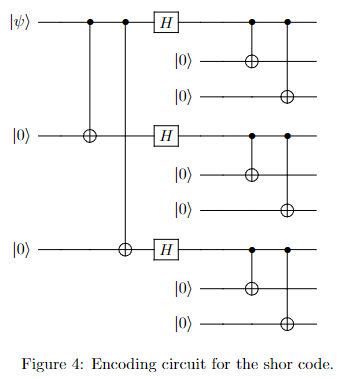

# The Shor code (Note in 10.2)
Shor code 是一个简单的量子纠错码，由 Michael A. Shor 在 1997 年提出，在单比特上，能够纠正量子比特的phase错误和bit flip 错误的组合。

## encoding
这个code 由前一章所提及的 three qubit phase flip and bit flip codes 组成。首先用 three qubit phase flip code 来 encode qubit：$|0\rangle \to |+++\rangle, |1\rangle \to |---\rangle$，接下来用 the three qubit bit flip code 来 encode the three qubits：$|+\rangle \to (|000\rangle + |111\rangle)\sqrt{2}, |-\rangle \to (|000\rangle - |111\rangle)\sqrt{2}$。

> 如何理解上述过程，本质上 bit flip code 的 encoding 为 $|0\rangle \to |000\rangle$，phase flip code 的 encoding 为 $|0\rangle \to |+++\rangle$，其他同理，套入进去即这个结果。

最终，我们有一个 9 qubit 的 Shor code，它能够针对任何的 error 进行纠错。
$$
|0\rangle \to |0_L\rangle = \frac{(|000\rangle+|111\rangle)(|000\rangle+|111\rangle)(|000\rangle+|111\rangle)}{2\sqrt{2}} \\
|1\rangle \to |1_L\rangle = \frac{(|000\rangle-|111\rangle)(|000\rangle-|111\rangle)(|000\rangle-|111\rangle)}{2\sqrt{2}}
$$

关于单比特 Shor code 的 encoding 电路，如下所示：

    

显然已经，也是由phase flip code 和 bit flip code 组成的。这种分层的编码方式，也称为 concatenation（级联），这是一种比较 trick 的创造新 code的方法。

记得上一章，我们把 quantum error correction 分为3步， encoding, error-detection (syndrome diagnosis), and decoding (recovery)。

> 下面我就统一称为encoding, error-detection, decoding。注意decoding在某些语境下，不包括recovery，只能找个一个可能的recovery算符或策略，具体将recovery的操作可以单独分出来。

## error-detection
接下来，我们简单分析一下 error-detection 的步骤，虽然大家可以简单理解 phase flip code 的 error-detection 可以检测到 phase flip error， bit flip code 可以检测到 bit flip error，但我们后续还是稍微分析一下。

> 有一些小的点需要注意：1. 每种 encoding 电路是理想的，encoding之前不存在该类的error。2.由于three qubit bit flip 和 three qubit phase flip 中的特殊假设，只考虑1个比特出现flip，因此上述暂时也是如此。

对于 bit flip，我们依旧可以通过 $Z_1Z_2, Z_2Z_3$，类似的用于判断任意三个量子比特之间是否存在 error，从而检测任意9个量子比特是否发生 bit 翻转，从而进行恢复即可。

对于 phase flip，第一块比特将会由$|000\rangle+|111\rangle$变为$|000\rangle-|111\rangle$，无论在第一块的三个比特中的任意比特发生，都会出现这个效果。如果phase flip 发生在任意前三个比特中，我们则会发现第一块与第二块的 sign 不同，第二块和第三块相同。我们可以 flip 第一块的三个比特的符号，使得其能够恢复原来的值。

> 如何进行恢复，为什么只需要检测块内是否发生 phase flip就可以了？ 后续进行解释。

因此，对于phase flip，我们可以通过$X_1X_2X_3X_4X_5X_6$和$X_4X_5X_6X_7X_8X_9$这两个算符作为 observables 来检测。前者检测前两块是否符号相同，后者检测后两块是否符号相同。并且如果第一块存在 phase flip，只需要用$Z_1Z_2Z_3$即可复原。

<!-- 为什么要有H门？由于我们没有先验信息，本质上只是通过判断理论上相同的两个比特，二者状态是否相同来寻找 error。假设没有H门，$|\psi\rangle = a|0\rangle+b|1\rangle$ 量子比特发生相位翻转，仅仅通过复制9份相互纠错、输出结果相同的量子态是没用的。通过相当于某个门作用一个H才可以知道有没有相位翻转，因为$|\psi\rangle = a|0\rangle+b|1\rangle$ 和 $|\psi\rangle = a|0\rangle - b|1\rangle$ 作用 H 门之后的结果是不一样的（当然，如果考虑全局相位，只有在量子态为$|0\rangle$，不考虑全局相位，只有在 $|0\rangle$ 或 $|1\rangle$ 的时候成立，但此时无论是否发生 phase flip error，都不会影响结果）。 -->

<!-- 因此，通过类似的$X_iX_j$，$Z_iZ_j$可以用于判断任意两个比特之间是否存在 phase flip error和 bit flip error。 -->

假设第一个比特同时发生bit and phase flip error，相当于$Z_1X_1$ 作用在此比特上。通过上述程序，也分别可以检测出bit flip error在第一个比特上，并且phase flip error 可以被检测在第一块的三个量子比特中，也可以进行纠错。

同时，Shor Code 不仅仅可以解决上述的组合，它是可以解决在单比特上的任意错误。错误可以是一个很小的旋转，比如绕 Bloch sphere 的 z-axis 旋转 $\pi/263$ 弧度，也可以是很大的错误，比如完全移除比特信息，用垃圾信息代替。不需要额外的工作，使用Shor Code 就可以解决。

这个例子说明了一个非常神奇的事情，在任意一个比特上，本来是用于纠正两种 discrete error 的 code 组合之后，也实现了对于任意 continuum 错误的纠正。这种 discretization of the errors 是量子纠错起作用的核心，并且应该与模拟系统 (analog systems) 的经典纠错相比较，在模拟系统中不可能进行这种误差的离散化。
